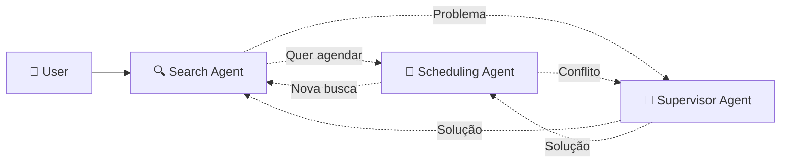

# 🏠 Sistema Agêntico Imobiliário com LangGraph-Swarm

## 🌟 Visão Geral

Sistema de inteligência artificial agêntico avançado para busca e agendamento de imóveis, implementando uma **arquitetura de enxame (swarm)** usando LangGraph-Swarm, onde agentes especializados colaboram dinamicamente para resolver consultas complexas de usuários.

### ✨ Principais Características

- 🤖 **Arquitetura Swarm**: Agentes se transferem dinamicamente baseado no contexto
- 🧠 **PydanticAI + LangGraph**: Combinação de tipagem forte com orquestração avançada  
- 🔄 **Handoffs Inteligentes**: Transferências automáticas entre agentes especializados
- 📊 **Observabilidade Completa**: Rastreamento detalhado com LangFuse e Logfire
- 🌐 **Integração MCP**: Acesso a múltiplas APIs de imóveis via Model Context Protocol
- 🇧🇷 **Totalmente em Português**: Interface e comunicação em português brasileiro

## 🏛️ Arquitetura

### Agentes Especializados

#### 🔍 **Search Agent** (Padrão ReAct)
- Interpreta consultas em linguagem natural
- Executa buscas inteligentes via MCP
- Aplica filtros e ranking de relevância
- **Transfere para**: Scheduling (quando usuário quer agendar) | Supervisor (validação)

#### 📅 **Scheduling Agent** (Padrão ReAct)  
- Gerencia agendamentos via Google Calendar
- Inteligência temporal avançada
- Validação de horários comerciais
- **Transfere para**: Search (nova busca) | Supervisor (conflitos)

#### 👥 **Supervisor Agent** (Padrão Chain-of-Drafts)
- Monitora qualidade das respostas
- Resolve problemas complexos
- Coordena fluxo entre agentes
- **Transfere para**: Qualquer agente conforme necessário

### Fluxo de Transferências (Handoffs)



## 🚀 Instalação e Configuração

### Pré-requisitos

- Python 3.11+
- Chaves de API configuradas (ver `.env.example`)

### Instalação

```bash
# Clonar repositório
git clone <repo-url>
cd Agentic-Real-Estate

# Instalar dependências
pip install -e .

# Configurar variáveis de ambiente
cp .env.example .env
# Editar .env com suas chaves de API
```

### Dependências Principais

```toml
# Core
"pydantic-ai>=0.0.14"        # Agentes com tipagem forte
"langgraph>=0.3.0"          # Orquestração de grafos
"langgraph-swarm>=0.0.11"   # Arquitetura de enxame

# Observabilidade
"langfuse>=2.0.0"           # LLMOps e analytics
"logfire>=0.70.0"           # Observabilidade nativa

# Integrações
"google-cloud-calendar"      # Google Calendar API
"fastapi>=0.115.0"          # API web
```

## 🎮 Uso do Sistema

### Exemplo Básico

```python
from agentic_real_estate.core.config import Settings
from agentic_real_estate.orchestration.swarm_orchestrator import SwarmOrchestrator

# Configurar sistema
settings = Settings()
orchestrator = SwarmOrchestrator(settings)

# Processar consulta
response = await orchestrator.process_query(
    "Quero um apartamento de 2 quartos em Copacabana até R$ 800.000"
)

print(f"Agente: {response.agent_name}")
print(f"Resposta: {response.content}")
```

### Demonstração Interativa

```bash
# Executar demonstração completa
python examples/swarm_demo.py

# Modo interativo
python examples/swarm_demo.py --interactive
```

### Casos de Uso Comuns

#### 1. Busca Seguida de Agendamento
```
👤 "Apartamento 2 quartos Copacabana até R$ 800k"
🔍 search_agent: [encontra propriedades]
👤 "Gostei do primeiro, quero visitar amanhã 14h"
🔄 Automático: search_agent → scheduling_agent  
📅 scheduling_agent: [agenda visita no Google Calendar]
```

#### 2. Resolução de Problemas
```
👤 "Os preços mostrados estão inconsistentes"
🔄 Automático: → supervisor_agent
👥 supervisor_agent: [analisa com Chain-of-Drafts]
✅ [resolve inconsistência e explica]
```

#### 3. Mudança de Contexto
```
👤 "Na verdade prefiro casas em Barra da Tijuca"  
🔄 Automático: → search_agent
🔍 search_agent: [nova busca com critérios atualizados]
```

## 🔧 Configuração Avançada

### Handoffs Personalizados

```python
from agentic_real_estate.orchestration.handoff_tools import create_real_estate_handoff_tool

# Criar handoff customizado
custom_handoff = create_real_estate_handoff_tool(
    agent_name="search_agent",
    name="find_luxury_properties", 
    description="Transferir para busca de imóveis de alto padrão",
    requires_context=True
)
```

### Observabilidade

```python
# Configurar LangFuse
export LANGFUSE_SECRET_KEY="your_key"
export LANGFUSE_PUBLIC_KEY="your_key" 
export LANGFUSE_HOST="https://your_langfuse_host"

# Configurar Logfire  
export LOGFIRE_TOKEN="your_token"
```

### Integração MCP

```python
# Configurar APIs de imóveis
export RENTCAST_API_KEY="your_key"
export FREEWEBAPI_KEY="your_key"

# Sistema automaticamente agrega dados de múltiplas fontes
```

## 📊 Monitoramento e Analytics

### LangFuse Dashboard
- Rastreamento de todas as interações
- Métricas de performance por agente
- Análise de custos e latência
- Debugging de conversas

### Logfire Observability
- Spans detalhados de execução
- Métricas em tempo real
- Alertas proativos
- Rastreamento de handoffs

### Métricas Importantes
- **Taxa de Transferência**: % consultas que resultam em handoffs
- **Precisão por Agente**: Satisfação com respostas específicas
- **Tempo de Resolução**: Latência fim-a-fim
- **Taxa de Supervisão**: % intervenções do supervisor

## 🧪 Desenvolvimento e Testes

### Estrutura do Projeto

```
agentic_real_estate/
├── core/                    # Configuração e modelos centrais
│   ├── config.py           # Settings com Pydantic
│   ├── models.py           # Modelos de dados
│   └── observability.py    # Setup de observabilidade
├── agents/                  # Agentes PydanticAI
│   ├── search_agent.py     # Agente de busca (ReAct)
│   ├── scheduling_agent.py # Agente de agendamento (ReAct)
│   └── supervisor_agent.py # Supervisor (Chain-of-Drafts)
├── orchestration/          # LangGraph-Swarm
│   ├── swarm_orchestrator.py # Orquestrador principal
│   └── handoff_tools.py    # Ferramentas de transferência
├── integrations/           # Integrações externas
│   └── mcp_server.py      # Servidor MCP para APIs
└── api/                   # API web (FastAPI)
```

### Executar Testes

```bash
# Testes unitários
python -m pytest tests/

# Testes de integração  
python -m pytest tests/integration/

# Testes do swarm
python -m pytest tests/orchestration/
```

### Debugging

```bash
# Modo debug com logs detalhados
export DEBUG=true
python examples/swarm_demo.py

# Visualizar grafo do swarm
python -c "
from agentic_real_estate.orchestration.swarm_orchestrator import SwarmOrchestrator
orchestrator = SwarmOrchestrator(Settings())
orchestrator.swarm.get_graph().print_ascii()
"
```

## 🚀 Deploy e Produção

### Docker
```bash
# Build da imagem
docker build -t agentic-real-estate .

# Executar container
docker run -p 8000:8000 agentic-real-estate
```

### API FastAPI
```bash
# Iniciar servidor de desenvolvimento
uvicorn agentic_real_estate.api.main:app --reload

# Acessar documentação
open http://localhost:8000/docs
```

### Escalabilidade
- Use Redis para cache distribuído
- Configure load balancer para múltiplas instâncias
- Monitore métricas de performance via LangFuse

## 📚 Documentação Adicional

- [📖 Arquitetura LangGraph-Swarm](docs/LANGGRAPH_SWARM_ARCHITECTURE.md)
- [🔧 Guia de Configuração](docs/CONFIGURATION.md)
- [🧪 Guia de Testes](docs/TESTING.md)
- [🚀 Guia de Deploy](docs/DEPLOYMENT.md)

## 🤝 Contribuição

1. Fork o projeto
2. Crie uma branch para sua feature (`git checkout -b feature/amazing-feature`)
3. Commit suas mudanças (`git commit -m 'Add amazing feature'`)
4. Push para a branch (`git push origin feature/amazing-feature`)
5. Abra um Pull Request

## 📄 Licença

Este projeto está licenciado sob a Licença MIT - veja o arquivo [LICENSE](LICENSE) para detalhes.

## 🔗 Links Úteis

- [LangGraph Documentation](https://langchain-ai.github.io/langgraph/)
- [LangGraph-Swarm Repository](https://github.com/langchain-ai/langgraph-swarm-py)
- [PydanticAI Documentation](https://ai.pydantic.dev/)
- [LangFuse Documentation](https://langfuse.com/docs)

---

**Desenvolvido com ❤️ usando PydanticAI + LangGraph-Swarm**
