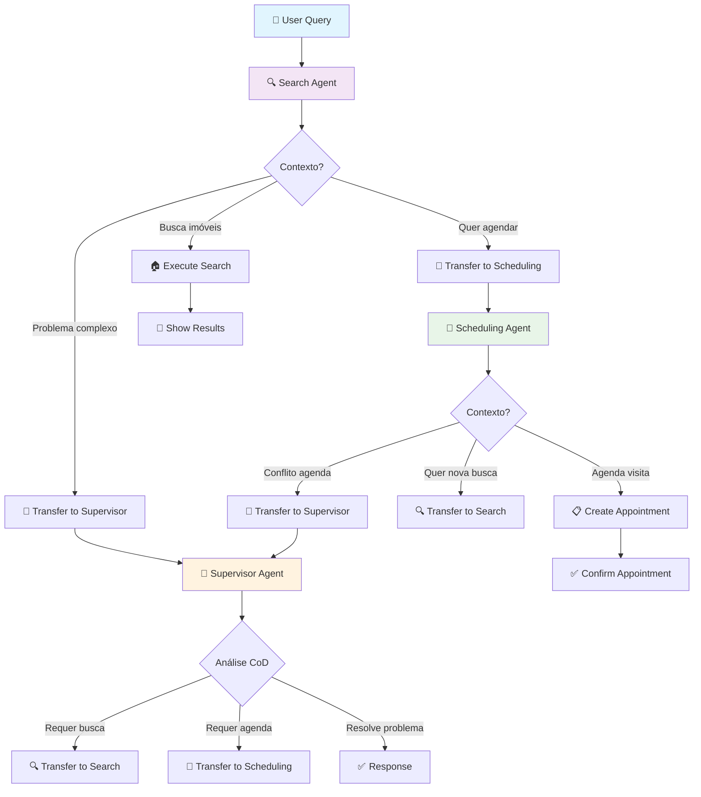

# Arquitetura LangGraph-Swarm do Sistema Imobiliário

## Visão Geral

Este documento explica como implementamos a arquitetura **LangGraph-Swarm** no sistema agêntico imobiliário, que permite que os agentes colaborem de forma descentralizada e dinâmica, transferindo controle baseado em suas especializações.

## Conceitos Fundamentais

### O que é LangGraph-Swarm?

LangGraph-Swarm é uma biblioteca especializada que implementa uma arquitetura multi-agente onde:

- **Agentes decidem autonomamente** quando transferir controle
- **Não há supervisor central** controlando o fluxo
- **Transferências (handoffs) são dinâmicas** baseadas no contexto
- **Estado é compartilhado** entre todos os agentes
- **Memória é preservada** através das transferências

### Diferenças da Arquitetura Supervisor

| Aspecto | Supervisor | Swarm |
|---------|------------|-------|
| **Controle** | Centralizado no supervisor | Descentralizado nos agentes |
| **Decisões** | Supervisor decide quem age | Agentes decidem quando transferir |
| **Escalabilidade** | Limitada pelo supervisor | Cresce com mais agentes |
| **Flexibilidade** | Roteamento pré-definido | Roteamento emergente |
| **Adaptabilidade** | Requer reconfiguração | Auto-adapta ao contexto |

## Arquitetura Implementada

### Componentes Principais

```
┌─────────────────────────────────────────────────┐
│              SwarmOrchestrator                  │
│  ┌─────────────────────────────────────────┐   │
│  │            LangGraph-Swarm              │   │
│  │  ┌─────────┐  ┌─────────┐  ┌─────────┐  │   │
│  │  │ Search  │  │Schedule │  │Supervisor│  │   │
│  │  │ Agent   │  │ Agent   │  │ Agent   │  │   │
│  │  └─────────┘  └─────────┘  └─────────┘  │   │
│  │       ↕           ↕           ↕        │   │
│  │  ┌─────────────────────────────────────┐  │   │
│  │  │        Handoff Tools             │  │   │
│  │  └─────────────────────────────────────┘  │   │
│  └─────────────────────────────────────────┘   │
│  ┌─────────────────────────────────────────┐   │
│  │         PydanticAI Agents             │   │
│  │  ┌─────────┐  ┌─────────┐  ┌─────────┐  │   │
│  │  │SearchAgt│  │Schedule │  │Supervisor│  │   │
│  │  │(ReAct)  │  │(ReAct)  │  │(CoD)    │  │   │
│  │  └─────────┘  └─────────┘  └─────────┘  │   │
│  └─────────────────────────────────────────┘   │
└─────────────────────────────────────────────────┘
```

### Fluxo de Transferências (Handoffs)



## Implementação Detalhada

### 1. Handoff Tools Personalizadas

```python
@tool("search_properties")
def search_properties_handoff(
    transfer_reason: str,  # LLM explica porque transfere
    state: InjectedState,  # Estado atual da conversa
    tool_call_id: InjectedToolCallId  # ID da chamada
) -> Command:
    return Command(
        goto="search_agent",  # Agente destino
        graph=Command.PARENT,  # Navegar no grafo pai
        update={  # Atualizar estado
            "messages": state["messages"] + [tool_message],
            "active_agent": "search_agent",
            "transfer_context": transfer_reason,
        }
    )
```

### 2. Agentes LangGraph Especializados

Cada agente LangGraph encapsula um agente PydanticAI:

```python
def _create_search_langgraph_agent(self):
    tools = [
        self._create_search_tool(),  # Funcionalidade do PydanticAI
        create_contextual_scheduling_handoff(),  # Transferir para agenda
        create_contextual_supervisor_handoff(),  # Transferir para supervisor
    ]
    
    return create_react_agent(
        model=self.search_agent.model,
        tools=tools,
        prompt="""Você é especialista em busca de imóveis.
        
        QUANDO TRANSFERIR:
        - Para scheduling_agent: Quando usuário quer agendar visitas
        - Para supervisor_agent: Quando houver inconsistências
        
        IMPORTANTE: Seja proativo em sugerir próximos passos.""",
        name="search_agent"
    )
```

### 3. Padrões Implementados

#### ReAct Pattern (Search & Scheduling)
- **Reasoning**: Analisa a consulta do usuário
- **Acting**: Executa ações (busca/agendamento) 
- **Observation**: Avalia resultados
- **Decision**: Decide se transfere ou continua

#### Chain-of-Drafts (Supervisor)
- **Draft 1**: Primeira análise do problema
- **Review**: Identifica pontos de melhoria
- **Draft 2**: Versão refinada
- **Final**: Solução validada e aprovada

#### Swarm Pattern (Todos)
- **Autonomia**: Cada agente decide quando transferir
- **Especialização**: Foco em domínio específico
- **Colaboração**: Transferência com contexto preservado
- **Emergência**: Solução surge da colaboração

## Vantagens da Implementação

### 1. Flexibilidade Dinâmica
```python
# Usuário pode mudar contexto dinamicamente
"Quero um apartamento" → search_agent
"Gostei, vamos agendar" → scheduling_agent (automático)
"Tenho dúvidas sobre o preço" → supervisor_agent (automático)
"Na verdade prefiro casas" → search_agent (automático)
```

### 2. Preservação de Contexto
- Histórico completo mantido através das transferências
- Agente receptor conhece toda a conversa
- Contexto específico da transferência explicado
- Estado compartilhado acessível a todos

### 3. Observabilidade Completa
```python
with logfire.span("handoff_to_scheduling") as span:
    span.set_attribute("transfer_reason", reason)
    span.set_attribute("target_agent", "scheduling_agent")
    span.set_attribute("messages_count", len(messages))
```

### 4. Escalabilidade
- Adicionar novos agentes não requer reconfiguração central
- Handoffs podem ser criados dinamicamente
- Sistema auto-adapta às novas capacidades

## Diferenças do Sistema Anterior

### Antes (Agentes PydanticAI Independentes)
```python
# Agentes isolados, sem comunicação
search_agent = SearchAgent(settings)
scheduling_agent = SchedulingAgent(settings) 
supervisor_agent = SupervisorAgent(settings)

# Usuário tinha que escolher manualmente qual agente usar
```

### Agora (LangGraph-Swarm)
```python
# Agentes colaboram automaticamente
orchestrator = SwarmOrchestrator(settings)
response = await orchestrator.process_query(
    "Quero apartamento e depois agendar visita"
)
# Sistema automaticamente: search → encontra → scheduling → agenda
```

## Casos de Uso Demonstrados

### Cenário 1: Busca → Agendamento
```
👤 "Apartamento 2 quartos Copacabana até R$ 800k"
🔍 search_agent: [busca propriedades]
👤 "Gostei do primeiro, quero visitar amanhã 14h"  
🔄 search_agent → scheduling_agent (automático)
📅 scheduling_agent: [agenda visita]
```

### Cenário 2: Problema → Supervisão
```
👤 "Os preços estão inconsistentes"
🔄 → supervisor_agent (automático)
👥 supervisor_agent: [analisa com Chain-of-Drafts]
```

### Cenário 3: Mudança de Contexto
```
👤 "Na verdade prefiro casas em Barra"
🔄 → search_agent (automático)
🔍 search_agent: [nova busca com critérios atualizados]
```

## Próximos Passos

1. **Integração Completa**: Conectar ferramentas com agentes PydanticAI reais
2. **Más Handoffs**: Criar transferências mais específicas por contexto
3. **Subgrafos**: Implementar sub-workflows para tarefas complexas
4. **Métricas**: Adicionar métricas de eficiência das transferências
5. **Interface Web**: Criar UI que mostre o fluxo de agentes em tempo real

## Conclusão

A implementação LangGraph-Swarm transforma nosso sistema de agentes independentes em um **enxame colaborativo inteligente**, onde:

- **Especialistas trabalham juntos** sem supervisor central
- **Transferências são contextuais** e automáticas  
- **Usuário tem experiência fluída** sem precisar gerenciar agentes
- **Sistema é extensível** e auto-adaptável
- **Qualidade é garantida** através de padrões robustos

Esta arquitetura representa uma evolução significativa em direção a sistemas multi-agente verdadeiramente inteligentes e colaborativos. 