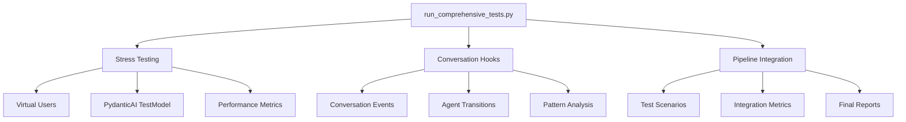

# Sistema de Testes Abrangentes - Real Estate Assistant

## 🎯 Visão Geral

Este sistema implementa uma solução completa de stress testing e validação para o Real Estate Assistant usando **PydanticAI**, hooks de conversa e pipelines de teste integrados. O objetivo é simular usuários reais e validar o comportamento do sistema agêntico em diferentes cenários.

## 🏗️ Arquitetura do Sistema



## 📁 Estrutura de Arquivos

```
tests/
├── test_stress_testing_pydantic.py    # Sistema de stress testing
├── test_conversation_hooks.py         # Hooks de análise de conversa
├── test_pipeline_integration.py       # Pipeline integrado
└── README_TESTING_SYSTEM.md          # Esta documentação

run_comprehensive_tests.py             # Script principal de execução
```

## 🚀 Como Usar

### 1. Execução Rápida (Recomendado para início)

```bash
python run_comprehensive_tests.py --quick
```

### 2. Stress Test Isolado

```bash
# Teste básico
python run_comprehensive_tests.py --stress

# Teste personalizado
python run_comprehensive_tests.py --stress --users 5 --questions 8
```

### 3. Análise de Conversas

```bash
python run_comprehensive_tests.py --conversation
```

### 4. Pipeline Completo

```bash
python run_comprehensive_tests.py --full
```

## 🧪 Componentes do Sistema

### 1. Stress Testing (`test_stress_testing_pydantic.py`)

#### Usuários Virtuais
- **Sarah Johnson**: Jovem profissional (1BR, $1500-2500)
- **Mike Rodriguez**: Pai de família (3BR, $2500-4000)
- **Emily Chen**: Estudante universitária (1BR, $800-1500)
- **David Thompson**: Executivo (2BR, $4000-8000)
- **Lisa Martinez**: Aposentada (2BR, $2000-3500)

#### Recursos
- Simulação de conversas realistas
- Testes de carga concorrente
- Métricas de performance
- Relatórios detalhados

#### Exemplo de Uso
```python
from test_stress_testing_pydantic import RealEstateStressTester

tester = RealEstateStressTester()
results = await tester.run_stress_test(concurrent_users=3, questions_per_user=5)
print(tester.generate_test_report(results))
```

### 2. Hooks de Conversa (`test_conversation_hooks.py`)

#### Hooks Padrão
- **agent_transitions**: Captura mudanças entre agentes
- **slow_responses**: Identifica respostas lentas (>5s)
- **price_discussions**: Detecta discussões sobre preços
- **scheduling_requests**: Captura pedidos de agendamento
- **error_responses**: Identifica problemas/erros

#### Fases da Conversa
- `GREETING`: Saudação inicial
- `SEARCH_CRITERIA`: Definição de critérios
- `PROPERTY_DETAILS`: Análise de propriedades
- `SCHEDULING`: Agendamento de visitas
- `CLOSING`: Finalização

#### Exemplo de Uso
```python
from test_conversation_hooks import ConversationAnalyzer

analyzer = ConversationAnalyzer()
analyzer.create_standard_hooks()
# ... adicionar eventos ...
report = analyzer.generate_conversation_report()
```

### 3. Pipeline Integrado (`test_pipeline_integration.py`)

#### Cenários de Teste
1. **basic_user_journey**: Jornada básica do usuário
2. **complex_search_scenario**: Busca complexa com múltiplos critérios
3. **high_volume_concurrent**: Teste de alto volume
4. **edge_cases_handling**: Casos extremos e erros

#### Métricas de Integração
- **system_coherence**: Coerência do sistema
- **agent_coordination**: Coordenação entre agentes
- **response_consistency**: Consistência de resposta
- **error_resilience**: Resiliência a erros
- **user_experience_score**: Score de experiência

## 📊 Métricas e Relatórios

### Métricas de Performance
- Taxa de sucesso (%)
- Tempo médio de resposta (s)
- Perguntas por segundo
- Distribuição de tempos (min, max, P95)

### Métricas de Conversa
- Transições entre agentes
- Padrões de fases
- Eventos capturados por hooks
- Qualidade da conversa

### Notas de Performance
- **A+ (Excelente)**: >95% sucesso, <2s resposta
- **A (Muito Bom)**: >90% sucesso, <3s resposta
- **B (Bom)**: >80% sucesso, <5s resposta
- **C (Satisfatório)**: >70% sucesso, <8s resposta
- **D (Precisa Melhorar)**: Abaixo dos limites

## 🔧 Configuração e Dependências

### Dependências Principais
```python
pydantic-ai
pytest
asyncio
requests
```

### Configuração de Ambiente
```python
# Desabilitar chamadas reais durante testes
models.ALLOW_MODEL_REQUESTS = False
```

### Para Windows
O sistema configura automaticamente o event loop para Windows:
```python
if sys.platform.startswith('win'):
    asyncio.set_event_loop_policy(asyncio.WindowsProactorEventLoopPolicy())
```

## 🎭 Simulação de Usuários Reais

### Personalidades Implementadas
- **Detail-oriented**: Faz perguntas específicas
- **Budget-conscious**: Foca no preço
- **Family-focused**: Pergunta sobre escolas/segurança
- **Luxury-seeking**: Busca propriedades premium
- **Location-flexible**: Aberto a diferentes áreas

### Estilos de Conversa
- **Direct**: Respostas diretas e objetivas
- **Thorough**: Análises detalhadas
- **Casual**: Conversa informal
- **Efficient**: Foco em eficiência
- **Friendly**: Tom amigável

## 📈 Interpretação de Resultados

### Status do Sistema
- 🟢 **Verde**: >90% sucesso - Sistema funcionando bem
- 🟡 **Amarelo**: 70-90% sucesso - Melhorias recomendadas
- 🔴 **Vermelho**: <70% sucesso - Atenção urgente

### Recomendações Comuns
- ⚡ Otimizar tempo de resposta
- 🔧 Melhorar taxa de sucesso
- 🤝 Melhorar coordenação entre agentes
- 👤 Melhorar experiência do usuário
- 📊 Reduzir variabilidade

## 🔄 Integração com CI/CD

### Execução Automatizada
```bash
# Validação rápida para CI
python run_comprehensive_tests.py --quick

# Teste completo para releases
python run_comprehensive_tests.py --full
```

### Saída em JSON
```python
# Os resultados podem ser salvos em JSON para análise
results_data = [...]
with open("test_results.json", "w") as f:
    json.dump(results_data, f, indent=2)
```

## 🐛 Troubleshooting

### Problemas Comuns

1. **Erro de importação**
   ```bash
   # Verificar se está no diretório correto
   cd Agentic-Real-Estate
   python run_comprehensive_tests.py --quick
   ```

2. **Timeout em testes**
   ```bash
   # Reduzir carga para debugging
   python run_comprehensive_tests.py --stress --users 1 --questions 2
   ```

3. **Falhas de conexão**
   ```python
   # Verificar se o servidor está rodando
   # O sistema usa Mock API em localhost:8000
   ```

## 📚 Exemplos de Uso Avançado

### Teste Personalizado
```python
# Criar usuário virtual personalizado
custom_user = VirtualUser(
    name="Test User",
    profile="Custom Profile",
    budget_min=1000,
    budget_max=3000,
    bedrooms=2,
    location_preferences=["Miami"],
    personality_traits=["test-oriented"],
    conversation_style="direct",
    questions=[]
)

# Executar teste específico
tester = RealEstateStressTester()
tester.virtual_users.append(custom_user)
results = await tester.run_stress_test(1, 3)
```

### Hook Personalizado
```python
# Criar hook personalizado
custom_hook = ConversationHook(
    "custom_pattern",
    lambda event: "custom_keyword" in event.user_input.lower()
)

analyzer = ConversationAnalyzer()
analyzer.add_hook(custom_hook)
```

## 🎯 Próximos Passos

1. **Expansão de Cenários**: Adicionar mais cenários de teste
2. **Métricas Avançadas**: Implementar métricas mais sofisticadas
3. **Integração com Monitoramento**: Conectar com sistemas de observabilidade
4. **Testes A/B**: Implementar comparação entre versões
5. **Machine Learning**: Usar ML para detectar padrões anômalos

## 📞 Suporte

Para dúvidas ou problemas:
1. Verificar logs detalhados com `--verbose`
2. Executar teste isolado para debugging
3. Consultar documentação do PydanticAI
4. Revisar configuração do ambiente

---

**Desenvolvido para garantir qualidade e confiabilidade do Real Estate Assistant** 🏠✨ 